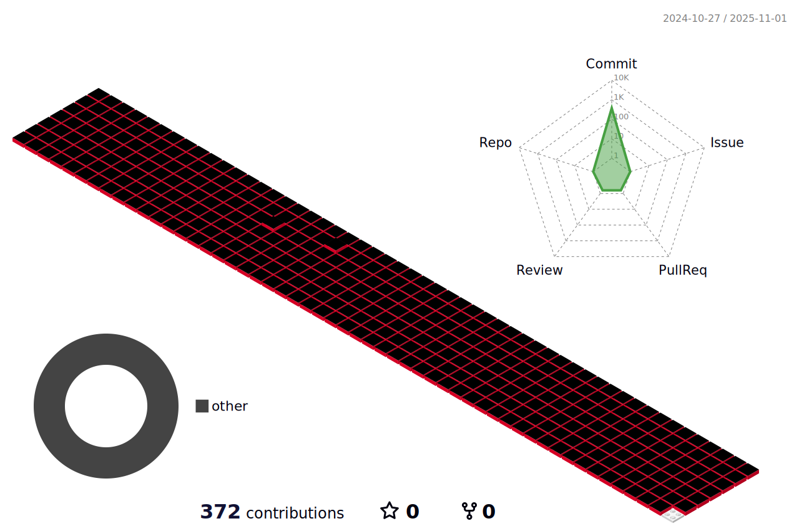

<!---->

  

	
	
	
	
	
	

## Introduction :raised_hands:
Hi, I am studying Computer Vision for Autonomous Driving :car:

Visual SLAM project - https://ssellu.github.io/#/frozen-city
  

## BOJ 📖: 
</a>

 
   

